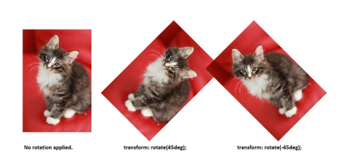
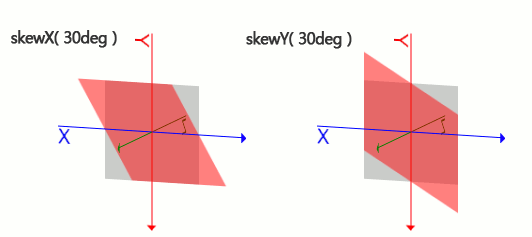
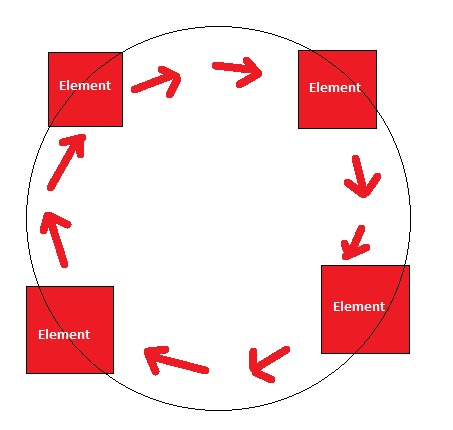

#  CSS Transforms

* The transform property applies a 2D or 3D transformation to an element. This property allows you to rotate, scale, move, skew elements.

* The transform property allows you to visually manipulate an element by skewing, rotating, translating, or scaling.

## VALUES:
* scale(): Affects the size of the element. This also applies to the font-size, padding, height, and width of an element, too. It’s also a a shorthand function for the scaleX and scaleY functions.

* skewX() and skewY(): Tilts an element to the left or right, like turning a rectangle into a parallelogram. skew() is a shorthand that combines skewX() and skewY by accepting both values.

* translate(): Moves an element sideways or up and down.

* rotate(): Rotates the element clockwise from its current position.

* matrix(): A function that is probably not intended to be written by hand, but combines all transforms into one.

* perspective(): Doesn’t affect the element itself, but affects the transforms of descendent elements’ 3D transforms, allowing them all to have a consistent depth perspective.

## SKEW 

* The skewX and skewY transform functions tilt an element one way or the other. Remember: there is no shorthand property for skewing an element, so you’ll need to use both functions.

## ROTATE 

* This rotates an element clockwise from its original position, whilst a negative value would rotate it in the opposite direction.

## TRANSLATE 

* This transform function moves an element sideways, or up and down.

